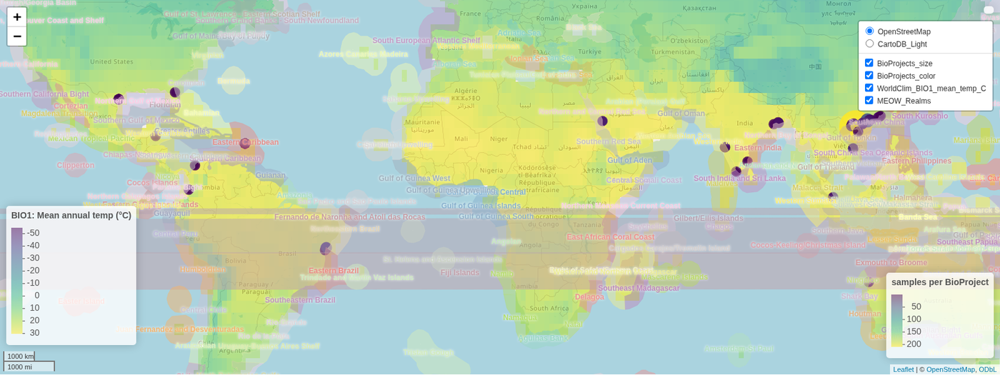

<p align="center">
  
</p>

# **MAGENTA:** The Global **MA**ngrove **GEN**e Ca**TA**logue

[](https://github.com/fjbalvino/magenta/actions/workflows/ci.yml)
[](LICENSE)

---

## 🌍 Descripción

Los manglares son una conocida reserva de diversidad biológica y un ecosistema altamente productivo.  
Diversos estudios metagenómicos en diferentes partes del mundo han reconocido a la comunidad microbiana del manglar como un agente importante dentro de los ciclos biogeoquímicos, en los cuales se llevan a cabo procesos tales como la transformación del carbono, la fotosíntesis, la fijación de nitrógeno y la reducción de azufre.  

En la actualidad, sin embargo, no contamos con una herramienta informática que nos permita entender estos procesos y relaciones a una **escala global**.

**MAGENTA** (o *Global MAngrove GENe CaTAlogue*) actúa como un catálogo global de genes únicos y no redundantes a nivel de especie (agrupados al 95% de identidad de nucleótidos). A partir de datos disponibles en bases de acceso público (WGS, metagenomas de acceso público – ENA) y considerando cinco de los principales hábitats microbianos del manglar (**rizosfera, agua de mar, sedimento, suelo y humedal**), MAGENTA busca formular nuevas hipótesis sobre la abundancia, distribución y funciones metabólicas de los microorganismos en este ecosistema.

---

## 🌍 Geography

MAGENTA leveraged publicly available metagenomic datasets of mangrove ecosystems sourced from the European Nucleotide Archive. In its analysis, MAGENTA systematically excluded incomplete or inconsistent datasets, resulting in **71 pairs of sequencing files** derived from seven distinct studies, spanning **12 geographic locations across three countries: China, India, and the United States**.

<p align="center">
  <a href="https://fjbalvino.github.io/magenta/" target="_blank">
    
  </a>
  <br/>
  <em>Click the image or use the badge below to open the interactive map</em>
</p>


---


## 🗺️ Diagrama (Mermaid)

```mermaid
flowchart LR
    A[Fetch metadatos] --> B[Descarga/Conversión]
    B --> C[FastQC paralelo]
    C --> D[Assembly: MEGAHIT o MetaSPAdes]
    D --> E[(Resultados)]
```



---

## 📂 Estructura

```
magenta/
├── notebooks/│   └── MAGENTA_preprocessing.ipynb
├── scripts/
│   ├── 01_magenta_fetch_mangrove.py
│   ├── magenta_fetch_non_mangrove.py
│   ├── 02_descargar_y_convertir_mangrove.py
│   ├── descargar_y_convertir_no_mangrove.py
│   ├── 04_fastqc_parallel.py
│   └── 06_assembly_serial.py
├── docs/
│   └── examples.md
├── .github/workflows/ci.yml
├── .gitignore
├── LICENSE
├── Makefile
├── environment.yml
├── requirements.txt
└── README.md
```

---

## 🚀 Quickstart

### 1) Clonar y crear entorno
```bash
git clone https://github.com/fjbalvino/magenta.git
cd magenta

# Opción A: conda (recomendado)
conda env create -f environment.yml
conda activate magenta

# Opción B: venv + pip (necesitarás fastqc/megahit/spades instalados por tu cuenta)
python -m venv .venv && source .venv/bin/activate
pip install -r requirements.txt
```

### 2) Ejecutar flujo mínimo
```bash
# Crea carpetas estándar
make setup

# 1) Fetch de manglares o no-manglar
make fetch_mangrove
# o
make fetch_non_mangrove

# 2) Descarga/Conversión
make download_mangrove
# o
make download_non_mangrove

# 3) QC en paralelo (FastQC)
make fastqc

# 4) Ensamblaje (MEGAHIT/MetaSPAdes según tu script)
make assemble
```

> **Nota:** Si usas `MultiQC`, añade tu comando dentro del target `make qc`.

---

## ⚙️ Variables y rutas

Los scripts trabajan cómodamente si defines variables de entorno como `MAGENTA_DIR` o `MAG_PROJECT_DIR`.  
Puedes exportarlas en tu shell o cargarlas desde `.env`:

```bash
export MAGENTA_DIR="$PWD"
export MAG_PROJECT_DIR="$PWD"
```

---

## ✅ CI (GitHub Actions)

El flujo de **CI** corre:
- **Black + Flake8** (formato y linting de código)
- Un _smoke test_ que invoca `--help` en cada script para verificar que el repositorio se mantiene saludable.

---

## 🤝 Contribuir

Lee [CONTRIBUTING.md](CONTRIBUTING.md) para pautas de estilo y PRs.

---

## 📜 Licencia

Este proyecto está bajo licencia [MIT](LICENSE).
